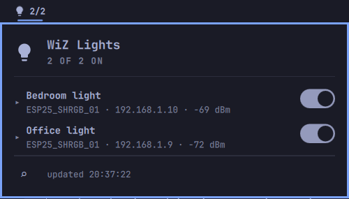

# kshatriya-abhay.wiz-lights

Smart home widget for [WiZ](https://www.wizconnected.com) bulbs (like Philips WiZ LED bulbs) on the local
network, for the Omarchy shell (Quickshell).



## Features

- UDP broadcast discovery of WiZ bulbs on the LAN (`getSystemConfig` on port 38899)
- Bar button showing how many bulbs are on (`n/m`)
- Popup listing every saved bulb with an on/off toggle
- Per-bulb advanced section (click a bulb row to expand):
  - Brightness slider (0-100%)
  - Warm/cool white slider (2200K-6500K)
  - Color: hue-saturation plane (X = hue, bottom = full saturation, top = white)
  - Live hex readout of the selected color
  - White/Warm preset buttons
  - Rename via the pencil button
- Active mode indicator: the bulb itself reports whether color or temperature
  mode is in effect (mutually exclusive); the inactive control dims
- Scan button (also `R` inside the panel) to re-discover; IPs update by MAC when DHCP changes them
- Slider drags are debounced (~200ms) and pause background polling while in use

## Requirements

- `python3` (stdlib only — no extra packages)
- UFW users must allow inbound replies from the LAN:

  ```sh
  sudo ufw allow in proto udp from 192.168.1.0/24 to any port 38899
  ```

## Installation

The plugin id is `kshatriya-abhay.wiz-lights`.

From the repository root:

```sh
omarchy plugin add https://github.com/kshatriya-abhay/omarchy-wiz-lights-plugin --enable
```

Or install manually by cloning the plugin into your user plugins directory:

```sh
git clone https://github.com/kshatriya-abhay/omarchy-wiz-lights-plugin \
  ~/.config/omarchy/plugins/kshatriya-abhay.wiz-lights
```

The shell picks up plugins under `~/.config/omarchy/plugins/` automatically
(hot-reload on save; force with `omarchy-shell shell rescanPlugins`).

To add the widget to the bar, put `{ "id": "kshatriya-abhay.wiz-lights" }` in the desired
section of `~/.config/omarchy/shell.json`, or move it later with
`omarchy bar move kshatriya-abhay.wiz-lights --section right`.

## Removal

```sh
omarchy plugin remove kshatriya-abhay.wiz-lights --yes
```

For a manual install, remove the folder and its entry from the bar layout:

```sh
rm -rf ~/.config/omarchy/plugins/kshatriya-abhay.wiz-lights
```

### Cleaning up plugin state

The plugin writes two kinds of state to disk. Neither is removed by the
commands above, so clean them up explicitly if you want a full uninstall:

| Path | Contents |
|------|----------|
| `~/.local/state/wiz-lights/lights.json` | Saved bulb list: MAC addresses, last-known IPs, and user-assigned names (personal data) |
| `~/.cache/quickshell/` | Compiled QML cache; the shell may briefly show the stale widget after removal until this is cleared |

To remove everything:

```sh
rm -f ~/.local/state/wiz-lights/lights.json
rmdir ~/.local/state/wiz-lights 2>/dev/null || true
omarchy restart shell
```

## How it works

`wizctl.py` talks the WiZ Local UDP API (JSON over UDP port 38899), same
protocol as the official local integration:

- discovery requires the request to be sent **from source port 38899** on some
  firmwares, so the helper binds that port
- `getPilot` polls state, `setPilot` sends commands
- color commands are sent as hex (`setPilot` still receives `r/g/b`, which is
  what the bulbs speak)

Discovered bulbs are persisted by MAC address in
`~/.local/state/wiz-lights/lights.json`, surviving reboots and IP changes.

## CLI

    python3 wizctl.py discover
    python3 wizctl.py status
    python3 wizctl.py set <ip> <on|off>
    python3 wizctl.py bright <ip> <0-100>
    python3 wizctl.py temp <ip> <2200-6500>
    python3 wizctl.py rgb <ip> <r> <g> <b>
    python3 wizctl.py color <ip> <#rrggbb>
    python3 wizctl.py rename <mac> <name>
    python3 wizctl.py forget <mac>

All list commands print a single line of JSON.

## Credits

The WiZ Local UDP protocol reference and color engine were derived from the
[kek's WiZ Light Controller](https://github.com/kek353/philipswizlightcontroller)
project (`wiz.py`), which is released under the GPL-3.0 license. This plugin
reimplements the protocol for the Omarchy shell and is distributed under the
same license (see [LICENSE](LICENSE)).
